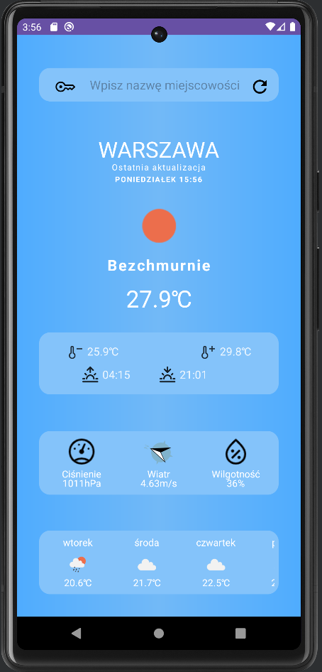

# Android Weather App
## Features

- Current weather report
    - Temperature(current, min, max)
    - Sunrise & sunset time
    - Pressure
    - Wind(direction & speed)
    - Humidity
- Simple 7-day forecast
    - Weather condition as an icon
    - Predicted temperature for 12:00PM of that day

## Requirements
- [OpenWeatherMap](https://openweathermap.org/api) API key

## Screenshots
